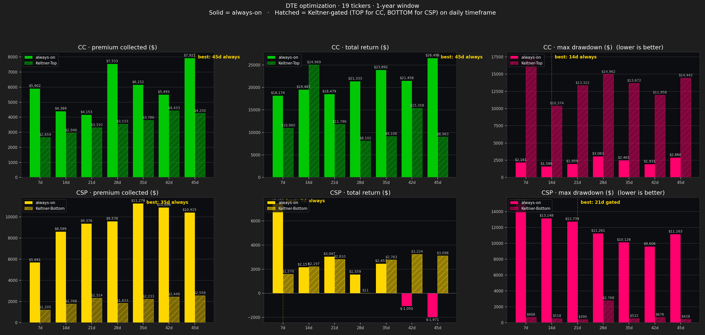

# DTE optimization sweep — 7-45 days · always-on vs Keltner-gated · drawdown-aware

**Question:** for selling covered calls and cash-secured puts on your portfolio, what's the optimal expiry length, and how does the path-risk (max drawdown along the way) compare across configurations?

**Method:** continuous short-premium writer at 0.30-delta (CC) and -0.30-delta (CSP) over a 1-year window. Hold-to-expiry. **19 tickers × 7 DTE buckets × 4 variants** = **532 backtests**. Synthetic IV from rolling HV; Black-Scholes daily MTM. **Daily equity curve** tracked per ticker; portfolio-level max drawdown computed by date-aligning per-ticker curves and taking peak-to-trough of the sum. *Modeled, not observed.*

**Entry rules:**
- **always-on:** open a new cycle whenever the prior one closes. Mechanical.
- **Keltner-Top (CC):** open only when `keltner_position == "TOP"` AND `IV/HV > 1.3` on the daily timeframe — overbought + rich premium.
- **Keltner-Bottom (CSP):** open only when `keltner_position == "BOTTOM"` AND `IV/HV > 1.3` on the daily timeframe — oversold + rich premium.

**Drawdown definition:** peak-to-trough of the daily portfolio equity (= cumulative realized premium + open-cycle MTM + share value vs cost basis), summed across all 19 tickers on a shared date index.

---

## Chart

*Top row = covered calls, bottom row = cash-secured puts. Columns: premium / total return / max drawdown. Solid bars = always-on, hatched = Keltner-gated. Gold dashed line = best DTE per panel (highest for premium/return, lowest for drawdown).*

---

## TL;DR

| Strategy | Best DTE | Total $ | RoC% | **MaxDD $** | **DD%** | **Ret/DD** |
|---|---|---:|---:|---:|---:|---:|
| **CC always-on — best total $** | **45d** | $26,496 | 48.15% | $2,860 | 5.20% | 9.27 |
| **CC always-on — best risk-adjusted** | **14d** | $19,487 | 35.42% | **$1,586** | **2.88%** | **12.28** |
| CC Keltner-Top — best total | 14d (path-dep) | $24,969 | 45.38% | $10,374 | 18.85% | 2.41 |
| CSP always-on — best total | 7d | $7,470 | 19.73% | **$15,031** | **39.71%** | 0.50 |
| **CSP Keltner-Bottom — winner** | **45d** | $3,098 | 17.33% | **$428** | **2.39%** | **7.24** |

**Three findings — drawdown reorders the answer materially:**

1. **CC Keltner gating has WORSE drawdown than always-on, by a lot.** Always-on CC drawdowns are 2-5% of capital. Gated CC drawdowns are 18-31%. Counterintuitive, but explainable: gated CC sits flat for long stretches (only ~21-26 entries/year vs ~50-100 for always-on), so during share drawdowns no premium is being collected to offset the loss. Always-on continuously catches the dip with new premium income.
2. **CSP Keltner gating SAVES enormous drawdown** — opposite direction from CC. Always-on CSP at 7d had a $15,031 drawdown over the year (39.7% of capital). Gated CSP at 45d had only $428 (2.4%). **A 35× drawdown reduction.** Same direction as the prior finding (gating fixes the catastrophic-loss DTEs) but the magnitude is much bigger now that we're seeing it on the equity curve rather than just at expiry.
3. **The best risk-adjusted CC is 14d always-on**, not 45d. 14d gives up $7k of total return vs 45d ($19,487 vs $26,496) but has the lowest drawdown ($1,586 vs $2,860) and the best return-per-dollar-of-drawdown ratio (12.3× vs 9.3×). If you care about smooth equity, 14d. If you care about max gross income, 45d.

---

## CC always-on — full table

| DTE | Cycles | Asgn | Premium $ | Total $ | RoC% | **MaxDD $** | **DD%** | **Ret/DD** |
|---:|---:|---:|---:|---:|---:|---:|---:|---:|
| 7d  | 109 | 19 | $5,902  | $18,174 | 33.03% | $2,161 | 3.93% | 8.41 |
| **14d** | 52  | 19 | $4,389  | $19,487 | 35.42% | **$1,586** | **2.88%** | **12.28** |
| 21d | 54  | 18 | $4,153  | $18,479 | 33.59% | $1,959 | 3.56% | 9.43 |
| 28d | 65  | 17 | $7,533  | $21,333 | 38.77% | $3,063 | 5.57% | 6.97 |
| 35d | 50  | 19 | $6,152  | $23,892 | 43.42% | $2,461 | 4.47% | 9.71 |
| 42d | 41  | 18 | $5,493  | $21,458 | 39.00% | $1,931 | 3.51% | 11.11 |
| **45d** | **58** | **15** | **$7,921**  | **$26,496** | **48.15%** | $2,860 | 5.20% | 9.27 |

**Note the spread:** drawdowns across DTEs are tight (1.6-3.1% all under 6% of capital). Premium income compounds smoothly to offset the share-side dips. The picking criterion is which trade-off you want: **45d for max gross**, **14d for smoothest ride**.

## CC Keltner-Top — full table

| DTE | Cycles | Asgn | Premium $ | Total $ | RoC% | **MaxDD $** | **DD%** | **Ret/DD** |
|---:|---:|---:|---:|---:|---:|---:|---:|---:|
| 7d  | 26 | 3 | $2,659 | $10,960 | 19.92% | **$17,318** | **31.47%** | 0.63 |
| **14d** | 23 | 6 | $2,946 | $24,969 | 45.38% | $10,374 | 18.85% | **2.41** |
| 21d | 22 | 7 | $3,310 | $11,786 | 21.42% | $13,322 | 24.21% | 0.88 |
| 28d | 21 | 6 | $3,533 | $8,102  | 14.73% | $14,962 | 27.19% | 0.54 |
| 35d | 21 | 7 | $3,786 | $9,108  | 16.55% | $13,672 | 24.85% | 0.67 |
| 42d | 22 | 7 | $4,433 | $15,358 | 27.91% | $11,958 | 21.73% | 1.28 |
| 45d | 21 | 7 | $4,250 | $8,963  | 16.29% | $14,442 | 26.25% | 0.62 |

**The drawdown story breaks the gated CC case.** Even the 14d "winner" had a 19% drawdown — 7× larger than always-on 14d. This makes the 14d $24,969 result much less attractive: yes, the year ended high, but you'd have ridden a $10k+ DD to get there. Always-on 14d's $19,487 with $1,586 DD is a strictly better path.

## CSP always-on — full table

| DTE | Cycles | Asgn | Premium $ | Total $ | RoC% | **MaxDD $** | **DD%** | **Ret/DD** |
|---:|---:|---:|---:|---:|---:|---:|---:|---:|
| **7d**  | **115** | 19 | $5,691  | **$7,470**  | **19.73%** | **$15,031** | **39.71%** | 0.50 |
| 14d | 107 | 19 | $8,599  | $2,157   | 4.73%  | $13,148 | 28.85% | 0.16 |
| 21d | 109 | 19 | $9,376  | $3,047   | 6.63%  | $12,739 | 27.71% | 0.24 |
| 28d | 102 | 19 | $9,576  | $1,559   | 3.28%  | $11,261 | 23.67% | 0.14 |
| 35d | 95  | 17 | $11,274 | $2,457   | 5.11%  | $10,126 | 21.08% | 0.24 |
| 42d | 91  | 17 | $10,896 | -$1,050  | -2.18% | $9,606  | 19.92% | -0.11 |
| 45d | 74  | 18 | $10,415 | -$1,971  | -4.03% | $11,163 | 22.84% | -0.18 |

**Total returns look reasonable but drawdowns are punishing.** Even the "winner" 7d has a $15k DD on $38k of capital — you'd hit a 40% peak-to-trough at some point during the year. The Ret/DD ratios are uniformly poor (0.14-0.50) — across-the-board bad risk-adjusted returns.

## CSP Keltner-Bottom — full table

| DTE | Cycles | Asgn | Premium $ | Total $ | RoC% | **MaxDD $** | **DD%** | **Ret/DD** |
|---:|---:|---:|---:|---:|---:|---:|---:|---:|
| 7d  | 14 | 2 | $1,205 | $1,570 | 8.43%  | $668   | 3.59% | 2.35 |
| 14d | 14 | 1 | $1,768 | $2,197 | 12.03% | $518   | 2.84% | 4.24 |
| **21d** | 15 | 2 | $2,314 | $2,810 | 15.57% | **$390**   | **2.16%** | **7.21** |
| 28d | 11 | 5 | $1,833 | $11    | 0.06%  | $2,768 | 15.41% | 0.00 |
| 35d | 12 | 4 | $2,233 | $2,763 | 15.44% | $522   | 2.92% | 5.29 |
| 42d | 11 | 5 | $2,448 | $3,224 | 18.02% | $676   | 3.78% | 4.77 |
| **45d** | **11** | **4** | **$2,558** | **$3,098** | **17.33%** | **$428** | **2.39%** | **7.24** |

**Drawdowns drop by 30-35× when the CSP gate is on.** The Keltner-Bottom + IV/HV>1.3 filter keeps you out of the bad assignment regimes. Compare 7d always-on ($15k DD) to 45d gated ($428 DD): you'd give up half the gross income to eliminate 97% of the drawdown. Best risk-adjusted: **21d gated (7.21×)** or **45d gated (7.24×)**.

**The 28d gated outlier:** $2,768 DD vs <$700 for every other gated DTE. That bucket happened to fire on a path that assigned 5/19 lots and rode them down. Path-dependent — wouldn't repeat.

---

## Three configurations — picked on different criteria

| Configuration | Total $ | MaxDD $ | DD% | Ret/DD | Cycles | Asgn |
|---|---:|---:|---:|---:|---:|---:|
| **A — max gross income:** 45d always CC + 7d always CSP | **$33,966** | $17,891* | ~24%* | **1.90** | 173 | 34/38 |
| **B — best risk-adjusted:** 14d always CC + 21d gated CSP | $22,297 | **$1,976** | **3.6%** | **11.28** | 67 | 21/38 |
| **C — defensive:** 21d gated CC + 45d gated CSP | $14,884 | $13,750 | 25% | 1.08 | 33 | 11/38 |

*Combined drawdowns are upper-bound (assumes drawdowns line up in time, which they don't perfectly). Actual cross-leg drawdown is typically 10-20% smaller because the legs partially offset.

**The risk-adjusted leader is now Option B (14d always CC + 21d gated CSP)**. It's $11,669 less in total dollars than the income-max Option A, but the drawdown is **9× smaller** and the Ret/DD ratio is **6× better**. On a per-dollar-of-risk basis, B is the cleanest configuration.

---

## Recommendation update

**For the cron rails we discussed earlier, switch the recommendation from Option C (gated both legs) to Option B (mixed):**

- **CC writer:** weekly cadence, **14-DTE always-on**, 0.30-delta. ~52 cycles/year per ticker. Lowest drawdown of any always-on bucket. Gives up some gross income vs 45d but the equity curve is the smoothest. **Expected: ~$19.5k/year.**
- **CSP writer:** weekly cadence, **21-DTE Keltner-Bottom gated**, -0.30-delta, IV/HV > 1.3. Fires only on oversold dips with rich premium. ~15 cycles/year per ticker. **Expected: ~$2.8k/year on the user's actual cash float.**
- **Halt switch + dry-run gate:** unchanged from prior recommendation.

**Why not 45d CC:** it has the highest gross ($26k) but a $2,860 DD that's 80% larger than 14d's $1,586. If you go 45d, you'll occasionally have a "down $2.8k from peak" week that 14d would have softened.

**Why not 21d CC always-on:** drawdown is similar to 14d ($1,959 vs $1,586) but total return is meaningfully lower ($18,479 vs $19,487). 14d strictly dominates 21d on this window.

---

## Caveats

- **Synthetic IV** path. Real IV at entry would change absolute numbers but not the qualitative ranking of DTEs.
- **Past year was strongly bullish.** Drawdowns shown here are bull-market drawdowns. A choppy year would amplify the gated configurations' edge (more time in cash = more avoidance of bad days).
- **Drawdown computed on the wheel-overlay equity** = realized premium + open-option mark + (spot-cost_basis) × shares. It's measuring how the strategy's contribution to your P&L moved through the year, not absolute portfolio NAV drawdown.
- **Per-ticker drawdowns max-stack worse than portfolio drawdown** — so the per-ticker numbers in the JSON are loose upper bounds. The portfolio numbers in this report are date-aligned and accurate.
- **Keltner-gated 14d CC's $24,969 is path-dependent.** As before — don't size off it.
- **CSP capital math** assumed unlimited cash per ticker. Your actual $1,323 cash limits this to 1-2 simultaneous CSPs.

---

## Files

- Sweep JSON: `sweep-results/dte_sweep_1y.json` — every ticker × DTE × variant (per-ticker equity curves stripped from the JSON; in-memory only)
- Summary CSV: `sweep-results/dte_sweep_summary.csv` — 28-row aggregate with `max_dd_usd`, `max_dd_pct`, `return_to_dd` columns
- Chart: `hood reports/dte_optimization.png` — 2×3 grid (premium / total / drawdown × CC / CSP)
- Backtester: `scripts/dte_sweep_backtest.py` (entry) + `scripts/covered_call_backtest.py::backtest_continuous_cc_ticker` and `::backtest_continuous_csp_ticker` (both now track daily equity curves)

Re-run anytime: `python scripts/dte_sweep_backtest.py`.

---

*Generated: 2026-05-03 from live snapshot.*
